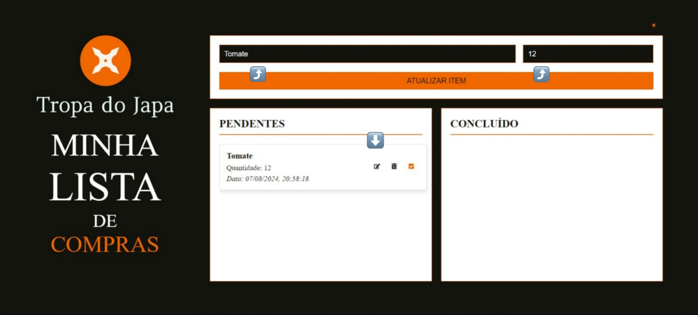

# Minha Lista de Compras - Tropa do Japa

## Documentação front-end

### Proposta dos stakeholders

> _Propomos o desenvolvimento de um aplicativo de lista de compras chamado "Minha Lista de Compras", que incluirá funcionalidades de adicionar, editar, remover e marcar itens como comprados. O desenvolvimento será realizado utilizando metodologia ágil._

#### Solicitações prévias dos stakeholders
##### Ideia do Software:
* Um aplicativo de lista de compras chamado "Minha Lista de Compras".
##### Requisitos:
1. Adicionar Itens:
O usuário deve poder adicionar itens à lista de compras com nome e quantidade.

2. Editar Itens:
O usuário deve poder editar os itens na lista (nome e quantidade).

3. Remover Itens:
O usuário deve poder remover itens da lista.

4. Marcar Itens como Comprados:
O usuário deve poder marcar itens como comprados.

5. Interface Simples:
A interface deve ser fácil de usar e intuitiva.

_A partir dessas informações e solicitações, iniciamos as discussões acerca do que deveríamos desenvolver e de qual maneira poderíamos tornar esse software usual, estilizado, rápido e intuitivo.
Para isso, partimos para a divisão dos trabalhos para que a produção pudesse ocorrer. No front-end iniciamos com a prototipação da tela para termos uma ideia de como iríamos distribuir as funções solicitadas pelos stakeholders para que tornasse o uso simples e eficaz, aproveitando para criar uma ideia de estilização do projeto._

### Prototipação
Fomos em busca de suprir tudo aquilo que nos foi solicitado e para isso listamos tudo que precisaríamos no software.
##### Listagem de necessidades do software
* Tela inicial.
* Título de descrição do software.
* Local para recebimento dos dados (Nome do item e quantidade).
* Botão para adicionar itens à lista.
* Listagem distintas para atividades pendentes e atividades concluídas.
* Botão para editar atividade.
* Botão para excluir atividade.
* Botão para marcar atividade como concluída.

###### Tela de prototipação light mode

###### Tela de prototipação dark mode

Após analisar cada uma das funcionalidades e discutirmos com a equipe de desenvolvimento, viu-se a necessidade de algumas alterações e adições que seriam essenciais para o funcionamento fluído, intuitivo e confortável do software, tornando a listagem de necessidades do software um pouco maior.

##### Novas adições
* *_Logo dos usuários na tela principal._*
* *_Necessidade de outro local para atualização dos dados a partir da função de edição._*
* *_Necessidade de outro botão para atualizar os itens ao invés de "adicioná-los"._*
* *_Adicionar botão de retomar a atividade concluída para pendente._*
* *_Necessidade de adicionar a data adição de itens à lista pendentes._*
* *_Necessidade de adicionar a data de compra dos itens à lista de concluído._*
* *_Necessidade de eliminar os botões de editar, excluir e marcar como concluído na listagem de concluídos._*
* *_Necessidade de utilizar o mesmo input para adição e edição dos itens*_
* *_Adição do botão para transição do light para dark mode._*
* *_Buscamos adaptar a tela para que não exista barra de rolagem na mesma, apenas dentro das lista de pendentes e concluídos. Tornando a imersão no software mais intuitiva e mais fluída quanto ao primeiro protótipo que a cada item adicionava uma barra de rolagem ainda maior na página._*
* *_Necessidade de diferenciar o nome dos itens em cada uma das listas, sendo o item riscado quando estiver concluído*_

Após cada uma dessas análises chegamos a prototipação final e iniciamos o processo de desenvolvimento da tela.

### Conclusão do desenvolvimento da tela e suas funcionalidades
###### Tela inicial em light mode, realizando o click no botão de transição entre os temas.

###### Tela inicial em dark mode.

###### Utilizando o input de nome para adicionar nome ao item.

###### Utilizando o input de quantidade para adicionar quantidade ao item.

###### Utilizando o botão de adicionar para levar os dados digitados até a lista de pendentes.

###### Utilizando a opção de editar item, que leva os dados do item para o mesmo campo alterando o botão para "Atualizar item".

###### Atualizando a quantidade do item de 12 para 14.

###### Demonstrando que o item foi atualizado para a quantidade descrita anteriormente (14).

###### Utilizando o botão de excluir item da lista.

###### Demonstrando que o item foi excluído da lista.

###### Após adicionar novamente o item à lista, realizamos a conclusão do item no botão "marcando como comprado".

###### Demonstrando que a atividade foi levada para a lista de concluído

###### Utilizando o botão de retornar item para a lista de pendentes

###### Demonstrando que o item retornou a lista de pendentes com a data de adição dele

###### Demonstrando o software com um item na lista de pendentes no light mode

