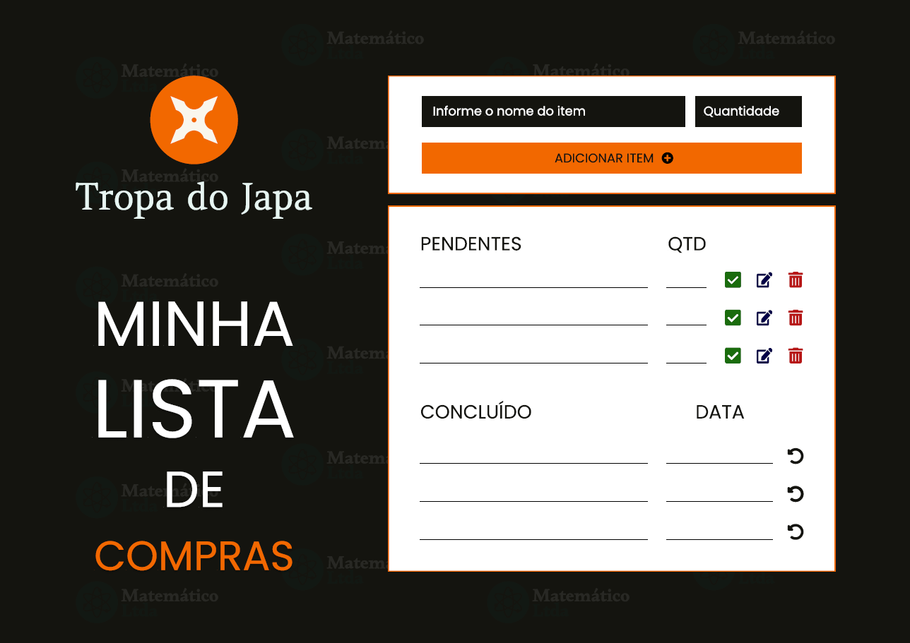

# Minha Lista de Compras - Tropa do Japa

## Documentação front-end

### Necessidades do software
* Tela inicial.
* Título de descrição do software.
* Local para recebimento dos dados (Nome do item e quantidade).
* Botão para adicionar itens à lista.
* Listagem distintas para atividades pendentes e atividades concluídas.
* Botão para editar atividade.
* Botão para excluir atividade.
* Botão para marcar atividade como concluída.

Essa foi a primeira listagem de necessidades do software que realizamos após conversa com os stakeholders, a partir disso buscando implementar e desenvolver o front-end para que cumpra com as solicitações, além de trazer um ambiente confortável e intuitivo aos usuários.

#### Primeiro protótipo

###### Tela de prototipação light mode

###### Tela de prototipação dark mode

A partir da primeira prototipação realizamos algumas alterações na implementação e estrutura do software, visto que, algumas funções não estavam com o funcionamento adequado e a usabilidade não estava agradável ao usuário. Por isso, realizamos alterações que foram aprovadas em discussão com a equipe para que pudéssemos entregar o melhor produto possível e que cumprisse com as necessidades do cliente com excelência.

##### Novas adições
* *_Logo dos usuários na tela principal._*
* *_Necessidade de outro local para atualização dos dados a partir da função de edição._*
* *_Necessidade de outro botão para atualizar os itens ao invés de "adicioná-los"._*
* *_Adicionar botão de retomar a atividade concluída para pendente._*
* *_Necessidade de adicionar a data adição de itens à lista pendentes._*
* *_Necessidade de adicionar a data de compra dos itens à lista de concluído._*
* *_Necessidade de eliminar os botões de editar, excluir e marcar como concluído na listagem de concluídos._*
* *_Necessidade de utilizar o mesmo input para adição e edição dos itens_*
* *_Adição do botão para transição do light para dark mode._*
* *_Buscamos adaptar a tela para que não exista barra de rolagem na mesma, apenas dentro das lista de pendentes e concluídos. Tornando a imersão no software mais intuitiva e mais fluída quanto ao primeiro protótipo que a cada item adicionava uma barra de rolagem ainda maior na página._*
* *_Necessidade de diferenciar o nome dos itens em cada uma das listas, sendo o item riscado quando estiver concluído_*

Com as novas adições vimos o software tomar forma e suprir a necessidade dos usuários de forma fluída, intuitiva e agradável, com possibilidades que agradam tanto usuários que preferem o modelo padrão de softwares em light mode quanto os que se sentem mais confortáveis com o dark mode. Dessa forma, podemos analisar o produto que entregaríamos e estudar suas possibilidades.

###### Tela inicial em dark mode.

###### Demonstrando o software no light mode

### Usabilidade
Algo que nos levou a analisar mudanças no software foi a usabilidade, que estava defasada após a prototipação inicial. Vimos a necessidade de estabalecermos uma página que proporcionasse ao usuário uma navegação fácil e visível, o que não tínhamos no primeiro modelo, já que a quanto mais itens o usuário adicionava em sua lista de pendentes ou concluído o scroll se tornava maior e a visibilidade menor.
Portanto, realizamos a implementação de uma página imóvel, que não apresenta barra de scroll, transferindo essa barra para movimentação distintas dentro de cada uma das listagens, desse modo proporcionamos ao usuário uma experiência agradável e fluída como buscávamos desde o início.

#### Campo de preenchimento do nome do produto
Nessa campo não realizamos mudanças significativas, visto que o mesmo cumpre seu papel de forma fácil e simples. 

#### Campo de preenchimento da quantidade do produto
De forma compatível com o campo de nome, nesse também não realizamos alterações.

#### Botão de adicionar item à lista
Botão de adicionar à lista é uma peça essencial em nosso software, visto que o mesmo realiza as validações e também aplica a adição dos itens no local designado. Dessa forma o botão ficou simples, eficaz e intuitivo ao uso. Além de adicionar o item à lista este botão registra a data em que o usuário o adicionou, possibilitando ao usuário a visualização da data em que o mesmo foi "criado" (adicionado à lista de pendentes).

#### Botão de editar item
O botão de edição dos itens foi pensado e estruturado para que o mesmo seja visível e usual apenas na lista de "pendentes", já que se tornaria inviável editar um item que já foi comprado. O mesmo realiza a reutilização dos campos de nome e quantidade, além de reutilizar o botão de "adicionar item" para a atualização já que quando o botão de edição é ativado, ele reencaminha as informações do produto para os campos e altera o nome do botão de "adicionar item" para "atualizar item". Tornando o software flexivel, estilizado, usual e agradável.

#### Botão de excluir item
O botão de excluir é utilizado para a remoção do item da lista de pendentes. Esse item não é direcionado à lista de concluídos quando esse botão é utilizado, ele é definitivamente excluído da lista. Esse botão também não aparece nos itens da lista de concluídos, visto que um item concluído não tem a necessidade de ser excluído. Já que a compra do mesmo foi realizada e o tornará um item a menos na lista. 

#### Botão de marcar item como comprado
Nesse botão declaramos que o item adicionado à lista de compras foi comprado e por isso ele transfere o item de tabela, pertencendo agora à tabela de concluídos. Onde o item permanece para que o usuário possa acompanhar um histórico do que já foi comprado da lista. Esse botão tem o gatilho de realizar alteração na data apresentada pelo item. Visto que, um item que foi concluído ficará armazanado com a data de compra e não com a data de adição do mesmo à lista de pendentes.

#### Botão de retornar item à lista de pendente
Na lista de concluídos, como citado anteriormente. Vimos a necessidade de retirarmos os botões que existiam na listagem de concluídos e passamos a análisar quais seriam as necessidades dessa outra listagem. Em discussão com toda a equipe o desenvolvimento decidiu realizar o uso de apenas um botão, que possibilite ao usuário retornar o item à lista de pendente. 
Esse botão é responsável por retornar o item à lista anterior, com a mesma data, nome e quantidade em que ele havia sido adicionado anteriormente. Possibilitando ao usuário uma experiência completa e de fácil utilização.

#### Data
Em uma lista de compra vimos a necessidade de demonstrar as datas de adição dos itens à lista e de compra dos mesmos. Para isso utilizamos a data em formato brasileiro sendo DD/MM/YYYY, HH:MM:SS, trazendo cada uma delas em cada um dos produtos. Sendo a data de adição do item na lista retornada na página dos pendentes e a data de edição do item retornada na lista dos concluídos.

#### Botão de tema
Por fim, realizamos a implementação do botão que realiza a alteração das cores do software, sendo possível alternar entre light e dark. Esses temas foram feitos com o intuito de trazer um aspecto mais moderno e confortável para os usuários que poderão optar pelas cores que preferirem.

### Validações
### Botão "adicionar item" ou "atualizar item"
No botão de adicionar ou atualizar item, adicionamos uma função que realiza a validação dos dados informados. 
1. Valida se o item foi preenchido.
2. Valida se o item é uma String.
3. Valida se a quantidade foi preenchida.
4. Valida se a quantidade é um número.

### Software implementado - Fase de testes
###### Utilizando o software em dark mode

###### Utilizando o software em light mode

